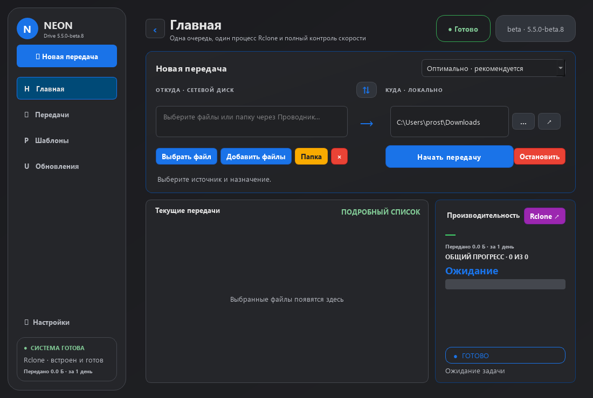

# Neon Drive

### Ваши файлы. Понятная передача. Windows + macOS.


## Скачать 5.6.0 Beta 3

| Система | Приложение со встроенным Rclone | Менеджер версий |
| :--- | :--- | :--- |
| 🪟 **Windows 10 / 11 · x64** | [⬇ Скачать Setup.exe](https://github.com/prostoodin1/neon-drive-downloader/releases/download/v5.6.0-beta.3/NeonDrive-Setup.exe) | [⬇ Скачать Installer.exe](https://github.com/prostoodin1/neon-drive-downloader/releases/download/v5.6.0-beta.3/NeonDriveInstaller.exe) |
| 🍎 **Mac · Apple Silicon** | [⬇ Скачать приложение ARM64.dmg](https://github.com/prostoodin1/neon-drive-downloader/releases/download/v5.6.0-beta.3/NeonDrive-macOS-arm64.dmg) | [⬇ Скачать установщик ARM64.dmg](https://github.com/prostoodin1/neon-drive-downloader/releases/download/v5.6.0-beta.3/NeonDriveInstaller-macOS-arm64.dmg) |
| 💻 **Mac · Intel** | [⬇ Скачать приложение x64.dmg](https://github.com/prostoodin1/neon-drive-downloader/releases/download/v5.6.0-beta.3/NeonDrive-macOS-x64.dmg) | [⬇ Скачать установщик x64.dmg](https://github.com/prostoodin1/neon-drive-downloader/releases/download/v5.6.0-beta.3/NeonDriveInstaller-macOS-x64.dmg) |

**Для Windows:** [установить Neon Drive](https://github.com/prostoodin1/neon-drive-downloader/releases/download/v5.6.0-beta.3/NeonDrive-Setup.exe) · [менеджер новых и старых версий](https://github.com/prostoodin1/neon-drive-downloader/releases/download/v5.6.0-beta.3/NeonDriveInstaller.exe).

[Все версии и изменения →](https://github.com/prostoodin1/neon-drive-downloader/releases)
· [Сообщить об ошибке →](https://github.com/prostoodin1/neon-drive-downloader/issues)

**Приложение** — готовый пакет со встроенным Rclone и скрытым CLI.
**Менеджер версий** — отдельное приложение для выбора, установки и переустановки
новых и предыдущих версий с историей изменений. GitHub Desktop, GitHub CLI,
Git и аккаунт GitHub **не нужны**. Публичных ZIP/portable-пакетов нет.

Neon Drive — независимое приложение, не продукт Google.



## Новое в 5.6.0 Beta 3

- **Полностью остановить:** отдельная видимая кнопка немедленно очищает очередь и
  закрывает все процессы Rclone, Robocopy и Turbo текущей передачи. Обычная кнопка
  «Остановить» по-прежнему работает как пауза с возможностью продолжения.
- **Проверка назначения:** совпадающие локальные файлы пропускаются до запуска,
  отличающиеся требуют подтверждения, а существующие папки безопасно объединяются.
  В Google Drive каждый объект перед выгрузкой сверяет Rclone.
- **Целые папки и свои диски:** кнопка «Добавить папку» работает для загрузки и
  выгрузки. Можно копировать папки между физическими, внешними и сетевыми дисками,
  не используя Google Drive.
- **Очистка «Передач»:** новая кнопка удаляет накопившиеся списки, строки, терминалы
  и графики загрузки/выгрузки, но не сбрасывает общий счётчик переданных данных.
- **Понятные Google-аккаунты:** для каждого подключения показываются почта,
  название профиля и тип аккаунта; почта активного аккаунта видна отдельно.

- **Сразу в Google Drive:** папка на виртуальном диске теперь автоматически
  передаётся прямому Neon Rclone. Промежуточного локального копирования и ожидания
  второй синхронизации клиента Google Drive больше нет.
- **Без потолка 56 МБ/с:** Neon не передаёт Rclone `--bwlimit` и больше не
  ограничивает облачную очередь четырьмя файлами. В режиме «все одновременно» можно
  использовать до десяти задач; реальная скорость зависит от сети, диска и Google.
- **Быстрее большие файлы:** чанк Google Drive теперь связан с профилем скорости:
  64 МиБ, 128 МиБ, 256 МиБ или 1 ГиБ. Новая установка начинает с быстрого профиля.
- **Ручной вариант сохранён:** если в настройках явно выбрано обычное копирование,
  файл по-прежнему отдаётся клиенту Google Drive for desktop.

- **Стабильнее Google Drive:** увеличены сетевые таймауты и повторы, добавлена
  плавная работа API-pacer без ограничения пропускной способности.
- **Автоскачивание из Google Drive:** выбранные в Проводнике файлы Google Drive
  автоматически преобразуются в прямые источники Neon Rclone, а назначение остаётся локальным.
- **Несколько файлов:** в «Шаблонах» можно выбрать очередь или одновременную передачу;
  Rclone и локальные движки запускают до десяти выбранных задач.
- **Продолжение с синей кнопки:** во время сохранённой паузы основная кнопка становится
  синей «Продолжить» и возобновляет те же процессы. Robocopy `/Z` включён во всех шаблонах.
- **Живые графики:** красный означает низкую скорость, жёлтый — среднюю, зелёный —
  высокую. Доступны общий график и история каждого файла, в том числе после завершения.

- **Несколько Google-аккаунтов:** добавляйте личные, Workspace и командные
  подключения, выбирайте активное и удаляйте или переподключайте каждое отдельно.
- **Настоящее «Остановить → Продолжить»:** активный Rclone не закрывается, поэтому
  продолжение использует тот же PID и resumable-сессию во всех шаблонах. Для этого
  Neon должен оставаться запущенным; полная отмена доступна отдельной кнопкой рядом.

- **Проводник сначала, Rclone потом:** конечная папка выбирается в обычном
  Проводнике/Finder и остаётся видимой в поле «Куда». Только при запуске Neon
  преобразует этот путь для Rclone — отдельный облачный поиск папок не открывается.
- **Автоопределение путей:** Neon различает физические диски (`C:`, `D:` и другие),
  сетевые папки, виртуальный Google Drive и прямое подключение OAuth2. Подписи
  «Откуда» / «Куда» и однозначное направление меняются автоматически.

- **Выбор облачной папки:** «Мой диск» и общие диски Google Drive, переход по папкам
  и подтверждение конкретного назначения по ID. Нажатие Google Drive больше не
  заменяет выбранный путь корнем «Моего диска».
- **Выбор маршрута:** при выборе папки Google Drive в Проводнике/Finder Neon
  предлагает прямую выгрузку по OAuth2 или обычное копирование через клиент Google.
  В настройках можно выбрать «спрашивать», «напрямую» или «обычное копирование».
- **«Остановить» рядом со стартом** на страницах загрузки и выгрузки, без открытия
  терминала. Активная передача сохраняет сессию для продолжения; ещё не начатая
  очередь отменяется обычным образом.
- **«Выбрать файл» заменяет список**, а «Добавить файлы» явно дополняет его.
- **«Экстрим»** — отдельный шаблон с чанком Google Drive 1024 МиБ (1 ГиБ).
  Для такого чанка применяется одна одновременная выгрузка файла.
- **Установщик без GitHub CLI:** публичный API, резервный публичный каталог,
  сохранённая история и кнопка «Установить файл…» для уже скачанного пакета.
- **Настоящие ссылки на пакеты** и в README, и в описании релиза.
  Ссылки в истории изменений установщика также открываются по нажатию.

### Как выбрать «Куда» на Google Drive

1. Выберите локальные файлы кнопкой **«Выбрать файл»** или **«Добавить файлы»**.
2. Выберите папку назначения в Проводнике/Finder. Для распознанного Google Drive
   появится предложение: **«Через Neon»** или **«Обычное копирование»**.
3. Для прямой выгрузки нажмите **Google Drive**, выберите конечную папку в обычном
   Проводнике/Finder и подключите нужный Google-аккаунт по OAuth2. Путь останется
   видимым; Neon Rclone получит его только при запуске передачи.
4. Проверьте показанный маршрут и нажмите **«Начать передачу»**.

Например, путь `H:/Unidades compartidas/Clients Materials/Test carpet` Neon
пытается сопоставить с общим диском **Clients Materials** и папкой **Test carpet**.
Для «Моего диска» путь преобразуется без запросов списка облачных папок. Для
общего диска на Windows Neon читает точные ID диска и выбранной папки из локального
кэша Google Drive for desktop только для чтения; вложенные папки по имени не
обходятся. Отмена сохраняет исходный путь.

Список общих дисков зависит от подключённого OAuth-аккаунта и его прав.
Если диск не виден, проверьте, что Neon и клиент Google используют нужный аккаунт.
Не найденный общий диск **не подменяется** «Моим диском».

**Важно:** копирование в виртуальную папку Google Drive и прямая выгрузка —
разные маршруты. В первом случае интернет-передачу выполняет клиент Google;
100% в Neon означает завершение копирования, а не завершение облачной синхронизации.
При прямой выгрузке данные отправляет встроенный Rclone через API Google Drive.

### Скорость, чанки и память

| Шаблон | Назначение | Чанк Google Drive |
| :--- | :--- | :--- |
| Медленно | Фоновая работа с ограничением нагрузки | 64 МиБ |
| Оптимально | Баланс скорости и ресурсов | 64 МиБ |
| Максимально | Без ограничения скорости со стороны профиля | 64 МиБ |
| Экстрим | Экспериментальный режим для больших выгрузок | 1024 МиБ |

Размер чанка Google Drive можно вручную выбрать в настройках поведения:
от **8 до 1024 МиБ**, степенями двойки. Это отдельный параметр от локальных чанков.

**Чанк 1 ГиБ требует примерно 1 ГиБ RAM только под один буфер**, плюс память
самого приложения и Rclone. Большие чанки ограничивают параллельность файлов,
чтобы не умножать этот расход. Размер чанка не обходит ограничения Google Drive,
провайдера, диска или сети и не гарантирует ускорение. При нехватке RAM используйте
«Оптимально» или меньший чанк. Профили не запускают несколько экземпляров Neon.

### Установка и обновления

Для обычной установки Windows достаточно скачанного **NeonDrive-Setup.exe**:
в нём уже есть приложение, Python/Qt, Rclone и CLI. Никакой GitHub-клиент не нужен.
На Mac откройте DMG своего процессора и перенесите приложение в Applications.

Менеджер версий загружает список и пакеты по публичным HTTPS-ссылкам.
Набор корневых HTTPS-сертификатов включён в пакет; проверка сертификатов
и имени сервера остаётся включённой.
При недоступности API он пробует резервный каталог, затем сохранённую историю.
**Интернет всё равно нужен для скачивания нового пакета.** Если пакет уже скачан,
откройте его напрямую или выберите **«Установить файл…»** в менеджере.
Сохранённый список может быть устаревшим. Последний успешно скачанный установщик
сохраняется; повреждённая новая загрузка не заменяет предыдущую.
Для новых пакетов проверяется SHA-256, если GitHub публикует контрольную сумму.

### Если Mac не открывает приложение

Требуется **macOS 12+**. Выберите Apple Silicon (ARM64) или Intel (x64)
в соответствии с «Об этом Mac». Нативная Apple Silicon-сборка не требует Rosetta;
старые Intel-only версии могут её потребовать.

Сборки пока **без Developer ID / нотарификации Apple**. Если macOS сообщает
о неизвестном разработчике, следуйте [инструкции Apple](https://support.apple.com/en-euro/102445)
и разрешайте запуск только если доверяете пакету. Защита системы не отключается.
Запуск, архитектура, установка, замена и удаление в Корзину проверяются на macOS 15
в CI; физический Mac с macOS 12 пока не проверен.

## Остальные возможности

- Robocopy, встроенный Rclone и безопасный совместный режим без двух движков,
  одновременно записывающих один файл.
- Ожидание готовности исходников, контроль изменения источника и прогресс по байтам.
- Необязательный файловый буфер **скачивания отдельных файлов**:
  временная папка `.neon-buffer-…` на диске назначения очищается после успеха
  или отмены. Если финальный перенос не удался, данные сохраняются для восстановления;
  после аварийного выключения буфер также может остаться. Папки и выгрузка работают напрямую.
- Приглушённая светлая и тёмная Google Drive-палитры, цветные кнопки,
  компактное окно, сворачиваемая боковая панель и запоминание настроек.
- Статус, скорость, ETA, общий счётчик переданных данных и отдельный монитор Rclone,
  который открывается только по желанию пользователя.
- Настройки через шестерёнку снизу, Advanced mode, диагностика и безопасная
  переустановка встроенного Rclone.
- Фоновая работа, автозапуск Windows/macOS и завершение после окончания очереди.
- Один экземпляр Neon и скрытый локальный CLI с JSON для AI-агентов.

В beta-версиях вкладка выгрузки включается дополнением в настройках обновлений.
Кнопка «После файла» позволяет остановить очередь после текущего файла.
Кнопка **«Остановить»** делает это сразу; исходники не удаляются.
Частичный результат зависит от движка: локальные данные могут сохраняться для
докачки, отменённая облачная выгрузка может потребовать повторного старта.

## Скрытый CLI для AI-агентов

CLI не является вкладкой. Он обращается к единственному запущенному Neon через
локальный IPC; ответы возвращаются в JSON.

```powershell
NeonDriveCLI.exe status
NeonDriveCLI.exe add --source "C:\Media\movie.mkv" --destination "NeonGoogleDrive:Video" --profile extreme --start
NeonDriveCLI.exe pause
NeonDriveCLI.exe resume
NeonDriveCLI.exe stop
```

## Запуск из исходников и сборка

```powershell
python -m venv .venv
.\.venv\Scripts\Activate.ps1
python -m pip install -r requirements.txt
python scripts/fetch_rclone.py
python main.py
```

Проверки: `python scripts/run_tests.py`. Сборка Windows: `.\build.ps1`.
GitHub Actions по тегу `v*` собирает Windows и обе архитектуры macOS,
проверяет пакеты, публикует релиз и обновляет публичный каталог установщика.
Журналы Windows: `%LOCALAPPDATA%\NeonDriveDownloader\logs\session-*.log`.
