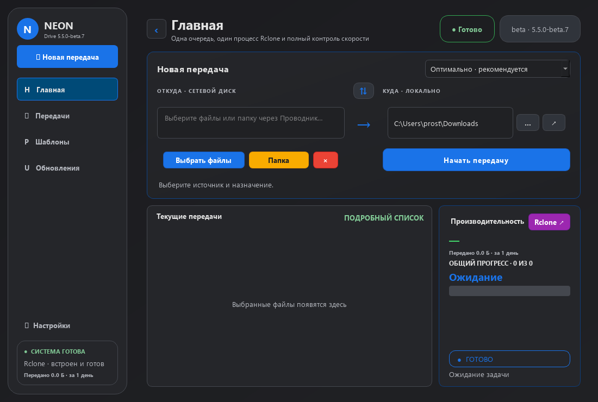

# Neon Drive

### Ваши файлы. Понятная передача. Windows + macOS.

## Скачать Beta 7

| Ваша система | Приложение | Установщик / менеджер версий |
| :--- | :--- | :--- |
| 🪟 **Windows 10 / 11 · x64** | [Установить Neon Drive](https://github.com/prostoodin1/neon-drive-downloader/releases/download/v5.5.0-beta.7/NeonDrive-Setup.exe) | [Выбрать новую или старую версию](https://github.com/prostoodin1/neon-drive-downloader/releases/download/v5.5.0-beta.7/NeonDriveInstaller.exe) |
| 🍎 **Mac · Apple Silicon** | [Neon Drive · ARM64](https://github.com/prostoodin1/neon-drive-downloader/releases/download/v5.5.0-beta.7/NeonDrive-macOS-arm64.dmg) | [Установщик · ARM64](https://github.com/prostoodin1/neon-drive-downloader/releases/download/v5.5.0-beta.7/NeonDriveInstaller-macOS-arm64.dmg) |
| 💻 **Mac · Intel** | [Neon Drive · x64](https://github.com/prostoodin1/neon-drive-downloader/releases/download/v5.5.0-beta.7/NeonDrive-macOS-x64.dmg) | [Установщик · x64](https://github.com/prostoodin1/neon-drive-downloader/releases/download/v5.5.0-beta.7/NeonDriveInstaller-macOS-x64.dmg) |

[Все версии и изменения →](https://github.com/prostoodin1/neon-drive-downloader/releases)
· [Сообщить об ошибке →](https://github.com/prostoodin1/neon-drive-downloader/issues)

**Приложение** — готовый пакет со встроенным Rclone. **Менеджер версий** —
отдельное приложение: показывает изменения, устанавливает выбранную версию,
позволяет вернуться к предыдущей. Публичных ZIP/portable-пакетов нет.
Neon Drive — независимое приложение, не продукт Google.

## Новое в Beta 7

| Интерфейс | Передачи | macOS |
| :--- | :--- | :--- |
| Тёмная Google Drive-палитра | Прогресс по байтам, а не целым процентам | Нативные Intel и Apple Silicon сборки |
| Цветные кнопки действий | Фоновая проверка исходников | Отдельный менеджер версий |
| Монитор Rclone только по кнопке | Необязательный дисковый буфер файлов | Установка, замена и удаление в Корзину |
| Подсказка маршрута | Ограничение буферов памяти Rclone | Проверка запуска .app при сборке |

### Буфер и направление

В настройках поведения включается файловый буфер загрузки. Он хранится в
скрытой папке `.neon-buffer-…` на диске назначения: после успешной передачи и
проверки готовый файл перемещается на место, временная папка удаляется. Отмена
или ошибка передачи удаляет временные данные, не трогая исходник. Если финальное
перемещение не удалось, готовый буфер сохраняется, а его путь показывается в логе.
После аварийного выключения такой буфер может остаться — проверьте его перед
ручным удалением. Папки и выгрузка работают напрямую; буфер по умолчанию выключен.

Автоопределение выбирает направление для распознанных сетевых и облачных путей;
для неоднозначных локальных путей остаётся ручной выбор. Папка Google Drive
в Проводнике/Finder **не равна прямой выгрузке**: её синхронизирует клиент Google.
Для отправки без этого клиента подключите Google Drive по OAuth2.

### Если Mac не открывает приложение

Выберите пакет своего процессора в «Об этом Mac». Требуется **macOS 12+**:
это минимум встроенного [Rclone](https://rclone.org/downloads/).
Apple Silicon-сборка Beta 7 не требует Rosetta. Старые Intel-only версии в истории
менеджера могут её потребовать. Перетащите приложение из DMG в Applications,
либо откройте отдельный Installer и выберите версию.

Сборки пока **без Developer ID / нотарификации Apple**. Если macOS сообщает
о неизвестном разработчике, следуйте [инструкции Apple](https://support.apple.com/en-euro/102445)
и разрешайте запуск только если доверяете скачанному пакету. Не отключайте защиту
системы целиком. Архитектура, запуск и установка проверяются на macOS 15 в CI;
физический Mac с macOS 12 пока не проверен. Для иной ошибки приложите её текст к issue.

## Разработка

Исходники Beta 7 находятся в [ветке agent/v5.4-turbo-beta](https://github.com/prostoodin1/neon-drive-downloader/tree/agent/v5.4-turbo-beta).
Инструкции запуска и сборки — в README этой ветки; точный код релиза доступен по [тегу v5.5.0-beta.7](https://github.com/prostoodin1/neon-drive-downloader/tree/v5.5.0-beta.7).
