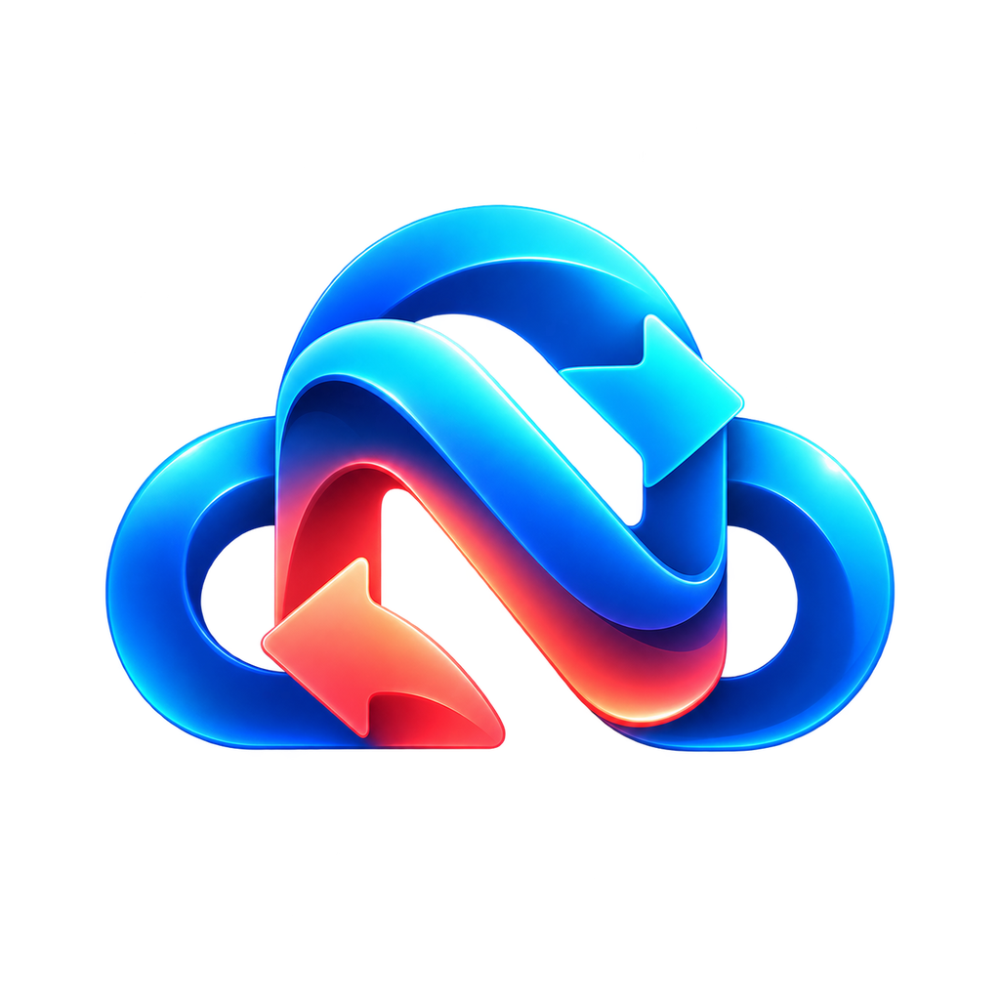
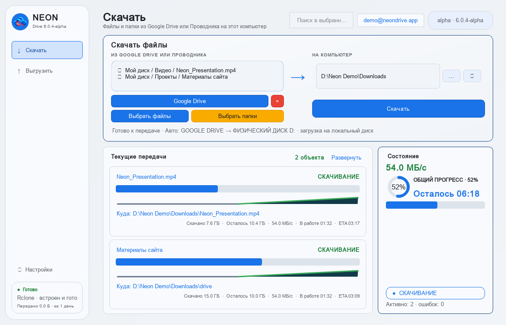
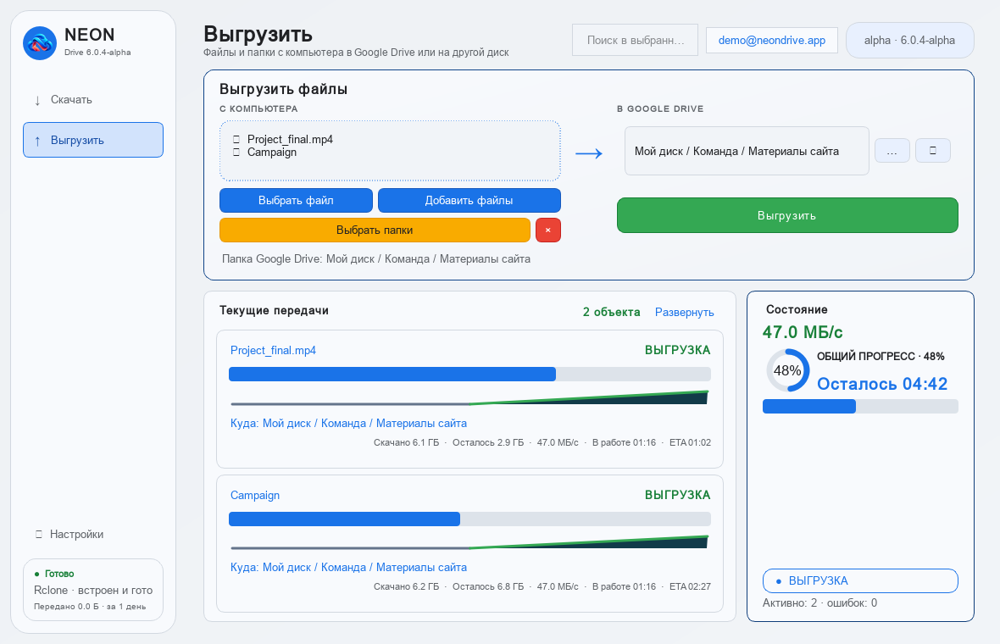
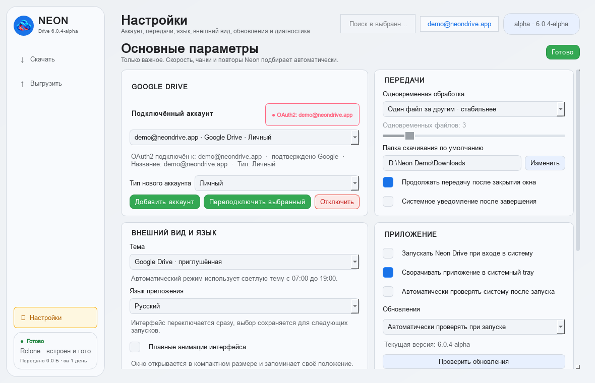
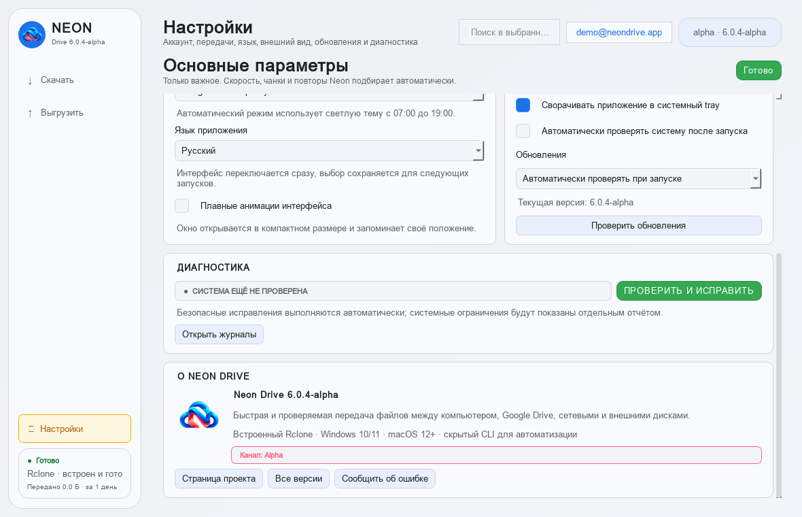

<div align="center">
  
  <h1>Neon Drive</h1>
  <p><strong>Fast, clear and verifiable file transfers.</strong><br>Google Drive · local disks · external drives · network storage</p>

  [](https://github.com/prostoodin1/neon-drive-downloader/releases/tag/v6.0.4-alpha)
  [](https://github.com/prostoodin1/neon-drive-downloader/releases/download/v6.0.4-alpha/NeonDrive-Setup.exe)
  [](https://github.com/prostoodin1/neon-drive-downloader/releases/tag/v6.0.4-alpha)
  [](https://github.com/prostoodin1/neon-drive-downloader/releases)
</div>

> [!IMPORTANT]
> **6.0.4 Alpha** is a preview build. Keep a backup of important files and verify critical transfers before deleting the source.

## Download · Скачать

| Platform | Neon Drive with bundled Rclone | Version Manager |
| :--- | :--- | :--- |
| **Windows 10/11 · x64** | [Download Setup.exe](https://github.com/prostoodin1/neon-drive-downloader/releases/download/v6.0.4-alpha/NeonDrive-Setup.exe) | [Download Installer.exe](https://github.com/prostoodin1/neon-drive-downloader/releases/download/v6.0.4-alpha/NeonDriveInstaller.exe) |
| **macOS · Apple Silicon** | [Download ARM64.dmg](https://github.com/prostoodin1/neon-drive-downloader/releases/download/v6.0.4-alpha/NeonDrive-macOS-arm64.dmg) | [Download Installer ARM64.dmg](https://github.com/prostoodin1/neon-drive-downloader/releases/download/v6.0.4-alpha/NeonDriveInstaller-macOS-arm64.dmg) |
| **macOS · Intel** | [Download x64.dmg](https://github.com/prostoodin1/neon-drive-downloader/releases/download/v6.0.4-alpha/NeonDrive-macOS-x64.dmg) | [Download Installer x64.dmg](https://github.com/prostoodin1/neon-drive-downloader/releases/download/v6.0.4-alpha/NeonDriveInstaller-macOS-x64.dmg) |

No ZIP archive, GitHub Desktop, GitHub CLI or GitHub account is required. The separate **Version Manager** can install a current or previous release and shows its changelog.

## Interface

| Download | Upload |
| :---: | :---: |
|  |  |

| Essential settings | About Neon Drive |
| :---: | :---: |
|  |  |

All screenshots are generated from the real application widgets using fictional paths and a demo account. They contain no developer workstation, user profile or private cloud data.

## What is new in 6.0.4 Alpha

- **Multilingual UI:** switch between Русский, English and Español in Settings. The language changes immediately and is remembered.
- **Official About section:** version, release channel, supported systems, bundled Rclone status and project links in one place.
- **New application icon:** a modern transfer-and-cloud mark used by the app, Windows installer and macOS bundles.
- **Privacy-safe media:** refreshed product screenshots contain only fictional demo paths and identities.
- **Polished compact layout:** Download and Upload remain the only primary pages; technical Rclone settings stay out of the normal workflow.
- **Readable folder picker:** a high-contrast light file list remains readable under every application theme.

## Основные возможности

- Скачивание из Google Drive через OAuth2 и встроенный Rclone.
- Выбор локальных файлов и целых папок через Проводник Windows или Finder.
- Выгрузка в Google Drive, на физический, внешний, сетевой или синхронизируемый диск.
- Несколько файлов последовательно, с ограниченной параллельностью или одновременно.
- Пауза, продолжение незавершённой передачи и полная остановка всех процессов задачи.
- Проверка уже существующих файлов, целостности источника и результата.
- Сохранение настроек и постоянного счётчика переданных данных между обновлениями.
- Один экземпляр Neon Drive и автоматическое завершение рабочих процессов после задачи.
- Скрытый `NeonDriveCLI` для локальной автоматизации и AI-агентов.

## Google Drive and privacy

Neon Drive opens Google's OAuth2 consent page and stores the resulting Rclone configuration in the local application-data directory. Passwords are never requested by Neon Drive. Direct cloud transfers use the account selected in Settings; ordinary Explorer/Finder copying remains available for mounted drives.

Neon Drive is an independent open-source application and is **not affiliated with or endorsed by Google**. Google Drive is a trademark of Google LLC.

## Quick start

1. Install the package for your system.
2. Open **Settings → Google Drive** and connect an account if direct cloud access is required.
3. Open **Download** or **Upload**, choose files or folders, select the destination and press the main action button.
4. Keep the source available until Neon reports that every item is complete and verified.

## Build from source

Requirements: Python 3.11+ (3.12 on Windows), PySide6 and the dependencies in `requirements.txt`.

```powershell
python -m venv .venv
.\.venv\Scripts\python.exe -m pip install -r requirements.txt
.\.venv\Scripts\python.exe main.py
```

Run the isolated test suite:

```powershell
.\.venv\Scripts\python.exe scripts\run_tests.py
```

## Project links

- [All releases](https://github.com/prostoodin1/neon-drive-downloader/releases)
- [Report a problem](https://github.com/prostoodin1/neon-drive-downloader/issues)
- [Changelog](CHANGELOG.md)
- [Generation 6 interface specification](docs/NEON_DRIVE_6_SPEC.md)

---

<div align="center">
  <strong>Neon Drive 6.0.4 Alpha</strong><br>
  Built for clear, recoverable and fast transfers.
</div>
